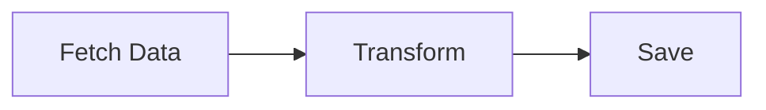
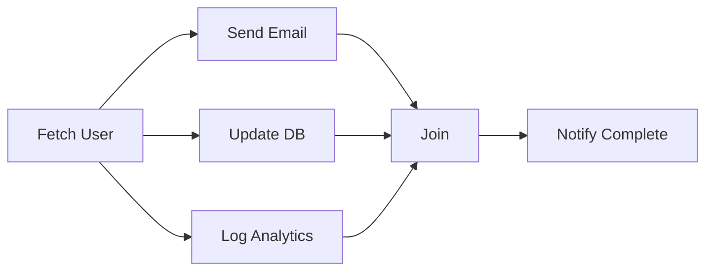
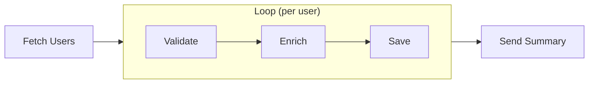
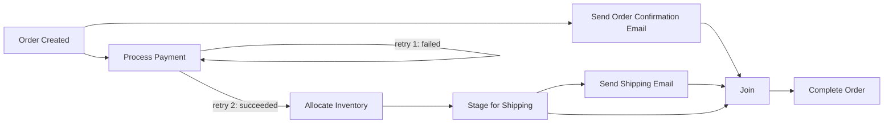

# Fuscia Use Cases

This document provides concrete workflow examples to illustrate Fuscia's capabilities.

## 1. Simple Linear Workflow

A basic workflow that fetches data, transforms it, and saves the result.

### Diagram



### Description

This is the simplest workflow pattern: a sequence of nodes where each node's output feeds into the next. There are no branches, loops, or error handling complexities.

**Scenario:** Fetch a JSON payload from an API, transform it (e.g., extract specific fields, rename keys), and save to a database.

### Workflow Definition

```json
{
  "workflow_id": "wf_simple_etl",
  "name": "Simple ETL Pipeline",
  "nodes": [
    {
      "node_id": "fetch_data",
      "component": "http-fetch",
      "inputs": {
        "url": "https://api.example.com/data",
        "method": "GET"
      }
    },
    {
      "node_id": "transform",
      "component": "json-transform",
      "inputs": {
        "data": "$.fetch_data.output.body",
        "mapping": {
          "id": "$.data.identifier",
          "name": "$.data.full_name",
          "email": "$.data.contact.email"
        }
      }
    },
    {
      "node_id": "save",
      "component": "db-insert",
      "inputs": {
        "table": "users",
        "record": "$.transform.output"
      }
    }
  ],
  "edges": [
    { "from": "fetch_data", "to": "transform" },
    { "from": "transform", "to": "save" }
  ]
}
```

---

## 2. Parallel Branches with Join

A workflow that splits into parallel branches and synchronizes at a join point.

### Diagram



### Description

After fetching user data, three independent operations run in parallel:
- Send a welcome email
- Update the database
- Log to analytics

The join node waits for all branches to complete before sending a completion notification.

### Workflow Definition (Using `All` Strategy)

The `All` strategy requires every branch to succeed. If any branch fails (after retries), the join fails and `notify_complete` does not run.

```json
{
  "workflow_id": "wf_parallel_all",
  "name": "User Onboarding (All Must Succeed)",
  "nodes": [
    {
      "node_id": "fetch_user",
      "component": "db-query",
      "inputs": {
        "query": "SELECT * FROM users WHERE id = $1",
        "params": ["$.trigger.user_id"]
      }
    },
    {
      "node_id": "send_email",
      "component": "email-sender",
      "inputs": {
        "to": "$.fetch_user.output.email",
        "subject": "Welcome!",
        "template": "welcome"
      }
    },
    {
      "node_id": "update_db",
      "component": "db-update",
      "inputs": {
        "query": "UPDATE users SET onboarded = true WHERE id = $1",
        "params": ["$.fetch_user.output.id"]
      }
    },
    {
      "node_id": "log_analytics",
      "component": "analytics-track",
      "inputs": {
        "event": "user_onboarded",
        "properties": {
          "user_id": "$.fetch_user.output.id"
        }
      }
    },
    {
      "node_id": "join",
      "type": "join",
      "join_type": {
        "strategy": "All"
      },
      "inputs": {
        "branches": ["send_email", "update_db", "log_analytics"]
      }
    },
    {
      "node_id": "notify_complete",
      "component": "slack-notify",
      "inputs": {
        "channel": "#onboarding",
        "message": "User $.fetch_user.output.email onboarded successfully"
      }
    }
  ],
  "edges": [
    { "from": "fetch_user", "to": "send_email" },
    { "from": "fetch_user", "to": "update_db" },
    { "from": "fetch_user", "to": "log_analytics" },
    { "from": "send_email", "to": "join" },
    { "from": "update_db", "to": "join" },
    { "from": "log_analytics", "to": "join" },
    { "from": "join", "to": "notify_complete" }
  ]
}
```

### Workflow Definition (Using `Any` Strategy)

The `Any` strategy proceeds if at least one branch succeeds. This is useful when branches are "nice to have" rather than critical.

```json
{
  "workflow_id": "wf_parallel_any",
  "name": "User Onboarding (Best Effort)",
  "nodes": [
    {
      "node_id": "fetch_user",
      "component": "db-query",
      "inputs": {
        "query": "SELECT * FROM users WHERE id = $1",
        "params": ["$.trigger.user_id"]
      }
    },
    {
      "node_id": "send_email",
      "component": "email-sender",
      "inputs": {
        "to": "$.fetch_user.output.email",
        "subject": "Welcome!",
        "template": "welcome"
      }
    },
    {
      "node_id": "update_db",
      "component": "db-update",
      "inputs": {
        "query": "UPDATE users SET onboarded = true WHERE id = $1",
        "params": ["$.fetch_user.output.id"]
      }
    },
    {
      "node_id": "log_analytics",
      "component": "analytics-track",
      "inputs": {
        "event": "user_onboarded",
        "properties": {
          "user_id": "$.fetch_user.output.id"
        }
      }
    },
    {
      "node_id": "join",
      "type": "join",
      "join_type": {
        "strategy": "Any"
      },
      "inputs": {
        "branches": ["send_email", "update_db", "log_analytics"]
      }
    },
    {
      "node_id": "notify_complete",
      "component": "slack-notify",
      "inputs": {
        "channel": "#onboarding",
        "message": "User onboarding attempted for $.fetch_user.output.email",
        "details": "$.join.output"
      }
    }
  ],
  "edges": [
    { "from": "fetch_user", "to": "send_email" },
    { "from": "fetch_user", "to": "update_db" },
    { "from": "fetch_user", "to": "log_analytics" },
    { "from": "send_email", "to": "join" },
    { "from": "update_db", "to": "join" },
    { "from": "log_analytics", "to": "join" },
    { "from": "join", "to": "notify_complete" }
  ]
}
```

---

## 3. Loop with Nested Nodes

A workflow that iterates over a collection and processes each item through nested nodes.

### Diagram



### Description

This workflow fetches a list of users, then for each user:
1. Validates the user data
2. Enriches with additional information (e.g., from external API)
3. Saves to database

After all users are processed, a summary email is sent.

**Loop Configuration:**
- Execution: Parallel with concurrency limit of 5
- Failure mode: `continue` (log errors, process remaining users)

### Workflow Definition

```json
{
  "workflow_id": "wf_user_sync",
  "name": "User Sync Pipeline",
  "nodes": [
    {
      "node_id": "fetch_users",
      "component": "db-query",
      "inputs": {
        "query": "SELECT * FROM pending_users"
      }
    },
    {
      "node_id": "process_loop",
      "type": "loop",
      "inputs": {
        "items": "$.fetch_users.output.rows"
      },
      "config": {
        "execution_mode": "parallel",
        "concurrency": 5,
        "failure_mode": "continue"
      },
      "nodes": [
        {
          "node_id": "validate",
          "component": "user-validator",
          "inputs": {
            "user": "$.item",
            "index": "$.index"
          }
        },
        {
          "node_id": "enrich",
          "component": "user-enricher",
          "inputs": {
            "user": "$.validate.output"
          }
        },
        {
          "node_id": "save",
          "component": "db-upsert",
          "inputs": {
            "table": "users",
            "record": "$.enrich.output"
          }
        }
      ],
      "edges": [
        { "from": "validate", "to": "enrich" },
        { "from": "enrich", "to": "save" }
      ]
    },
    {
      "node_id": "send_summary",
      "component": "email-sender",
      "inputs": {
        "to": "admin@example.com",
        "subject": "User Sync Complete",
        "body": {
          "total": "$.process_loop.output.length",
          "succeeded": "$.process_loop.output.filter(r => r.status === 'succeeded').length",
          "failed": "$.process_loop.output.filter(r => r.status === 'failed').length"
        }
      }
    }
  ],
  "edges": [
    { "from": "fetch_users", "to": "process_loop" },
    { "from": "process_loop", "to": "send_summary" }
  ]
}
```

---

## 4. Error Handling: Order Processing

A comprehensive example showing retries, non-critical nodes, and mixed success/failure outcomes.

### Diagram



### Description

This workflow processes a new order with the following behavior:

1. **Order Created** - Trigger event
2. **Process Payment** - Critical node with retries
   - First attempt fails (e.g., payment gateway timeout)
   - Retry succeeds
3. **Send Order Confirmation Email** - Non-critical, runs in parallel with payment
   - Succeeds
4. **Allocate Inventory** - Critical, runs after payment succeeds
5. **Stage for Shipping** - Critical
6. **Send Shipping Email** - Non-critical
   - Fails (e.g., email service down)
7. **Join** - Waits for all branches
8. **Complete Order** - Final status update

**Outcome:** Workflow completes with `completed_with_errors` status because:
- All critical nodes succeeded
- One non-critical node (shipping email) failed

### Workflow Definition

```json
{
  "workflow_id": "wf_order_processing",
  "name": "Order Processing",
  "defaults": {
    "retry": {
      "max_attempts": 3,
      "backoff": "exponential",
      "initial_delay_ms": 1000
    },
    "timeout_ms": 30000
  },
  "nodes": [
    {
      "node_id": "order_created",
      "component": "event-trigger",
      "inputs": {
        "event_type": "order.created"
      }
    },
    {
      "node_id": "process_payment",
      "component": "payment-processor",
      "inputs": {
        "order_id": "$.order_created.output.order_id",
        "amount": "$.order_created.output.total",
        "payment_method": "$.order_created.output.payment_method"
      },
      "config": {
        "retry": {
          "max_attempts": 3
        },
        "fail_workflow": true
      }
    },
    {
      "node_id": "send_order_confirmation",
      "component": "email-sender",
      "inputs": {
        "to": "$.order_created.output.customer_email",
        "subject": "Order Confirmed: #$.order_created.output.order_id",
        "template": "order_confirmation",
        "data": "$.order_created.output"
      },
      "config": {
        "fail_workflow": false
      }
    },
    {
      "node_id": "allocate_inventory",
      "component": "inventory-allocator",
      "inputs": {
        "order_id": "$.order_created.output.order_id",
        "items": "$.order_created.output.line_items"
      },
      "config": {
        "fail_workflow": true
      }
    },
    {
      "node_id": "stage_for_shipping",
      "component": "shipping-stager",
      "inputs": {
        "order_id": "$.order_created.output.order_id",
        "allocation": "$.allocate_inventory.output",
        "shipping_address": "$.order_created.output.shipping_address"
      },
      "config": {
        "fail_workflow": true
      }
    },
    {
      "node_id": "send_shipping_email",
      "component": "email-sender",
      "inputs": {
        "to": "$.order_created.output.customer_email",
        "subject": "Your Order Has Shipped: #$.order_created.output.order_id",
        "template": "shipping_notification",
        "data": {
          "order": "$.order_created.output",
          "tracking": "$.stage_for_shipping.output.tracking_number"
        }
      },
      "config": {
        "fail_workflow": false
      }
    },
    {
      "node_id": "join",
      "type": "join",
      "join_type": {
        "strategy": "All"
      },
      "inputs": {
        "branches": ["send_order_confirmation", "stage_for_shipping", "send_shipping_email"]
      }
    },
    {
      "node_id": "complete_order",
      "component": "order-updater",
      "inputs": {
        "order_id": "$.order_created.output.order_id",
        "status": "completed",
        "notes": {
          "payment_processed": true,
          "confirmation_sent": "$.join.output.send_order_confirmation.status",
          "shipping_email_sent": "$.join.output.send_shipping_email.status"
        }
      }
    }
  ],
  "edges": [
    { "from": "order_created", "to": "process_payment" },
    { "from": "order_created", "to": "send_order_confirmation" },
    { "from": "process_payment", "to": "allocate_inventory" },
    { "from": "allocate_inventory", "to": "stage_for_shipping" },
    { "from": "stage_for_shipping", "to": "send_shipping_email" },
    { "from": "send_order_confirmation", "to": "join" },
    { "from": "stage_for_shipping", "to": "join" },
    { "from": "send_shipping_email", "to": "join" },
    { "from": "join", "to": "complete_order" }
  ]
}
```

### Execution Timeline

| Step | Node | Attempt | Result | Notes |
|------|------|---------|--------|-------|
| 1 | order_created | 1 | succeeded | Trigger received |
| 2 | process_payment | 1 | failed | Gateway timeout |
| 2 | send_order_confirmation | 1 | succeeded | Runs in parallel |
| 3 | process_payment | 2 | succeeded | Retry succeeded |
| 4 | allocate_inventory | 1 | succeeded | |
| 5 | stage_for_shipping | 1 | succeeded | |
| 6 | send_shipping_email | 1 | failed | Email service down |
| 7 | join | 1 | succeeded | All branches complete |
| 8 | complete_order | 1 | succeeded | |

**Final Status:** `completed_with_errors`
- Critical path: All succeeded
- Non-critical failures: `send_shipping_email`
