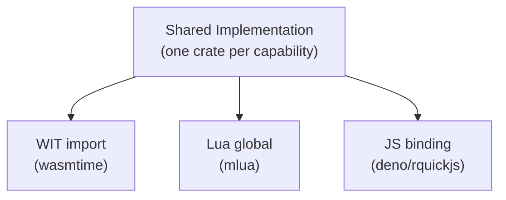

# Host Capabilities

Host capabilities are services provided to running tasks. Each capability has **one implementation** shared across all runtimes. Runtimes only write thin binding glue to expose these to their VM.

## Design Principle



The actual logic (making HTTP requests, reading KV, writing logs) lives in one place. Each runtime has a thin adapter — typically a few lines — that maps its VM's foreign function interface to the shared implementation.

## Capability Crates

Each capability is its own crate. These crates have **zero knowledge** of wasmtime, Lua, or any VM.

### `fuschia-host-kv` — Key-Value Store

Workflow-scoped key-value storage. Shared across tasks within an execution — node 1 can write, node 2 can read.

```rust
pub trait KvStore: Send + Sync {
    fn get(&self, key: &str) -> Pin<Box<dyn Future<Output = Option<String>> + Send + '_>>;
    fn set(&mut self, key: &str, value: String) -> Pin<Box<dyn Future<Output = ()> + Send + '_>>;
    fn delete(&mut self, key: &str) -> Pin<Box<dyn Future<Output = ()> + Send + '_>>;
}
```

Wrapped in `Arc<Mutex<dyn KvStore>>` in the `Capabilities` struct for shared mutable access.

Implementations:
- `InMemoryKvStore` — HashMap-based, for single-execution or testing
- Future: Redis-backed for persistence across executions

### `fuschia-host-config` — Configuration

Read-only configuration lookup. Values come from the workflow node definition.

```rust
pub trait ConfigHost: Send + Sync {
    fn get(&self, key: &str) -> Option<&str>;
}
```

Implementation: `MapConfig` — backed by `HashMap<String, String>`.

### `fuschia-host-log` — Logging

Routes component logs to the host's tracing infrastructure with execution context.

```rust
pub trait LogHost: Send + Sync {
    fn log(&self, level: LogLevel, message: &str);
}
```

Implementation: `TracingLogHost` — routes to the `tracing` crate with `execution_id` and `node_id` as span fields.

### `fuschia-host-http` — HTTP Client

HTTP requests with policy enforcement.

```rust
pub struct HttpPolicy {
    pub allowed_hosts: Vec<String>,  // supports wildcards: "*.googleapis.com"
}

pub trait HttpHost: Send + Sync {
    fn request(&self, req: HttpRequest)
        -> Pin<Box<dyn Future<Output = Result<HttpResponse, HttpError>> + Send + '_>>;
}
```

Implementation: `ReqwestHttpHost` — validates each request against the policy before making the call. Requests to disallowed hosts are rejected with `HttpError::HostNotAllowed`. Empty `allowed_hosts` denies all. `HttpPolicy::allow_all()` permits all hosts.

### `fuschia-host-fs` — Filesystem (Future)

Filesystem access with path policy enforcement.

```rust
pub struct FsPolicy {
    pub allowed_paths: Vec<String>,
}

pub trait FsHost: Send + Sync {
    fn read(&self, path: &str) -> Pin<Box<dyn Future<Output = Result<Vec<u8>, FsError>> + Send + '_>>;
    fn write(&self, path: &str, data: &[u8]) -> Pin<Box<dyn Future<Output = Result<(), FsError>> + Send + '_>>;
}
```

## Capability Provisioning

Capabilities are constructed **per-node**. Each node gets its own `Capabilities` instance with policies derived from its component manifest. Some backing resources are shared across the workflow, others are node-specific:

| Capability | Scope | Why |
|-----------|-------|-----|
| KV | Workflow | Nodes communicate via shared state |
| Config | Node | Each node has its own configuration values |
| Log | Node | Different `node_id` for log correlation |
| HTTP | Node | Each node declares its own `allowed_hosts` |

The orchestrator constructs capabilities like this:

```rust
// Workflow-scoped (shared across nodes)
let kv = Arc::new(Mutex::new(InMemoryKvStore::new()));

// Per-node
let caps = Capabilities {
    kv: Arc::clone(&kv),
    config: Arc::new(MapConfig::new(node_config)),
    log: Arc::new(TracingLogHost::new(exec_id, node_id)),
    http: Arc::new(ReqwestHttpHost::new(HttpPolicy {
        allowed_hosts: manifest.allowed_hosts.clone(),
    })),
};
```

This keeps policy decisions in the orchestrator and enforcement in the shared capability implementations. Runtimes never make policy decisions.
