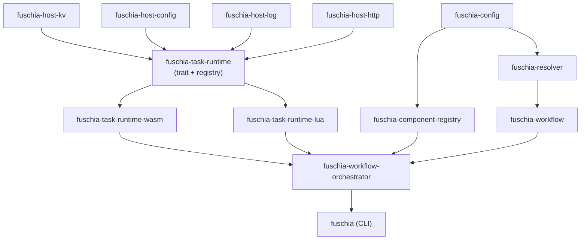

# Crate Map

## Current Crates

### Configuration & Data Model

| Crate | Description | Dependencies |
|-------|-------------|--------------|
| `fuschia-config` | Serializable workflow configuration (JSON). WorkflowDef, NodeDef, edges, RuntimeType. | serde |
| `fuschia-workflow` | Locked/resolved workflow with graph traversal. Validated DAG. | fuschia-config |
| `fuschia-component-registry` | Component manifest, registry trait, filesystem registry, in-memory test registry. | fuschia-config |
| `fuschia-resolver` | Transform WorkflowDef → Workflow. Validate graph, resolve components. | fuschia-config, fuschia-workflow, fuschia-component-registry |
| `fuschia-artifact` | Artifact storage trait + FsStore implementation. | — |
| `fuschia-world` | Wasmtime bindgen host world. Generates Rust bindings from WIT. | wasmtime |

### Host Capabilities

| Crate | Description | Dependencies |
|-------|-------------|--------------|
| `fuschia-host-kv` | `KvStore` trait + `InMemoryKvStore`. Execution-scoped key-value storage. | — |
| `fuschia-host-config` | `ConfigHost` trait + `MapConfig`. Read-only config lookup. | — |
| `fuschia-host-log` | `LogHost` trait + `TracingLogHost`. Routes logs to tracing with execution context. | tracing |
| `fuschia-host-http` | `HttpHost` trait + `ReqwestHttpHost` + `HttpPolicy`. HTTP with host allowlist enforcement. | reqwest |

### Runtime Abstraction

| Crate | Description | Dependencies | Status |
|-------|-------------|--------------|--------|
| `fuschia-task-runtime` | `NodeExecutor` trait, `Capabilities` struct, `RuntimeRegistry`, `RuntimeType` enum. Feature-gated variants (`wasm`, `lua`). | fuschia-host-* | Done |
| `fuschia-task-runtime-wasm` | `WasmExecutor`: wasmtime `NodeExecutor` impl. Owns engine + component cache. Fresh VM instance per execution, shared capabilities. | fuschia-task-runtime, wasmtime | Done |
| `fuschia-task-runtime-lua` | `LuaExecutor`: mlua `NodeExecutor` impl. Executes Lua scripts with `execute(ctx, data)` function contract. | fuschia-task-runtime, mlua | Done |

### Orchestration

| Crate | Description | Dependencies |
|-------|-------------|--------------|
| `fuschia-workflow-orchestrator` | Workflow execution: DAG traversal, wave-based scheduling, input resolution, runtime dispatch. Fully runtime-agnostic — delegates all execution to `RuntimeRegistry`. | fuschia-workflow, fuschia-task-runtime, fuschia-host-*, fuschia-component-registry |

### Planned

| Crate | Description |
|-------|-------------|
| `fuschia-host-fs` | Filesystem access + `FsPolicy` (allowed_paths) |
| `fuschia-task-runtime-js` | JavaScript `NodeExecutor` impl |

## Dependency Flow

## Removed Crates

The following crates were removed during the runtime abstraction refactor:

| Crate | Reason |
|-------|--------|
| `fuschia-runtime` | Replaced by `fuschia-workflow-orchestrator` |
| `fuschia-engine` | `WorkflowRunner` wrapper was unused; CLI uses orchestrator directly |
| `fuschia-task` | Superseded by `fuschia-task-runtime` |
| `fuschia-task-host` | Superseded by `fuschia-task-runtime-wasm` |
| `fuschia-trigger` | Superseded by unified trigger execution in orchestrator |
| `fuschia-trigger-host` | Triggers now execute through `RuntimeRegistry` like tasks |
| `fuschia-host` | Shared wasmtime infra; replaced by per-capability crates (host-kv, host-config, etc.) |
