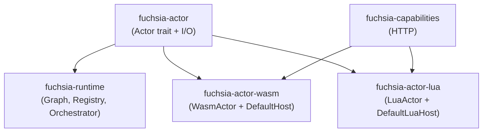

# Crate Map

Fuchsia is five crates: a lean API surface (`fuchsia-actor`), the engine
(`fuchsia-runtime`), a small capability library (`fuchsia-capabilities`),
and two actor implementations for Wasm and Lua. Hosts depend on whichever
subset they need.

## Crates

| Crate | Role | Dependencies |
|-------|------|--------------|
| `fuchsia-actor` | `Actor` trait + `Inbox` / `Emitter` / `Context` / `ActorError`. The API surface third-party actor packs depend on — kept intentionally lean so plugin authors don't transitively pull in the engine. | `async-trait`, `serde_json`, `thiserror`, `tokio[sync]`, `tokio-util[rt]`, `tracing` |
| `fuchsia-runtime` | `Graph`, `Node`, `Edge`, `ActorRegistry`, `ActorFactory`, `Orchestrator`, `WorkflowHandle`. Wires bounded tokio mpsc channels per graph edge, spawns one task per node, handles cancellation and completion-cascade. Criterion benches live under `benches/`. | `fuchsia-actor`, `serde`, `serde_json`, `tokio`, `tokio-util`, `tracing` |
| `fuchsia-capabilities` | Universal capability interfaces. Currently `http::HttpClient` async trait + `AllowedHosts` policy + `ReqwestHttp` default impl. Hosts inject these into actor constructors. | `async-trait`, `reqwest`, `thiserror`, `url` |
| `fuchsia-actor-wasm` | Wasm-component-hosting `Actor` implementation. `WasmActor<H: WasmHost>` is generic over a host trait so hosts can define their own WIT world. Persistent `Store` per actor; drives the component's `setup`/`handle`/`teardown` lifecycle. Ships `DefaultHost` for the canonical `actor-component` world (log + http + emit). | `fuchsia-actor`, `fuchsia-capabilities`, `async-trait`, `futures`, `serde_json`, `tokio`, `tracing`, `wasmtime` (component-model + async), `wasmtime-wasi` |
| `fuchsia-actor-lua` | Lua-script-hosting `Actor` implementation. `LuaActor<H: LuaHost>` mirrors `WasmActor` — generic over a host trait that owns global registration. Persistent VM per actor; drives optional `setup()` / required `handle(ctx, msg)` / optional `teardown()`. Ships `DefaultLuaHost` with log + http + emit. | `fuchsia-actor`, `fuchsia-capabilities`, `async-trait`, `futures`, `mlua` (lua54 + send + vendored), `serde_json`, `tokio`, `tracing` |

## Dependency Flow

`fuchsia-actor` is the only crate everyone else depends on. `fuchsia-runtime`
doesn't depend on the language hosts — it knows about `Actor` and that's it.
Language hosts depend on `fuchsia-actor` (for the trait) and `fuchsia-capabilities`
(for the trait their `DefaultHost` consumes); they don't depend on each other
or on the runtime.

## Test Components

- `test-components/test-actor-component/` — a small wasm component built
  against the `actor-component` world (log + emit imports, actor
  lifecycle export). Used by the `fuchsia-actor-wasm` integration test.
  Workspace-excluded; requires `cargo component build --release` before
  tests run.

## What's Not Here

Things you might expect to find as crates and don't, because they're host
concerns rather than runtime concerns:

- **No component registry / install layer.** Hosts decide where Wasm
  components and Lua scripts live, how they're versioned, and how digests
  are verified. The actor crates accept already-loaded bytes (or compiled
  components) at construction time.
- **No artifact storage.** Same reason.
- **No CLI.** Fuchsia is a library. If you want a CLI, build one against
  `fuchsia-runtime` that loads a graph JSON and a set of actor registrations.
- **No KV / config capability traits.** Universal-but-debatable capabilities
  (key-value stores, configuration sources) are not in `fuchsia-capabilities`.
  Hosts that need them can define their own traits and inject implementations
  through their own `WasmHost` / `LuaHost`.
